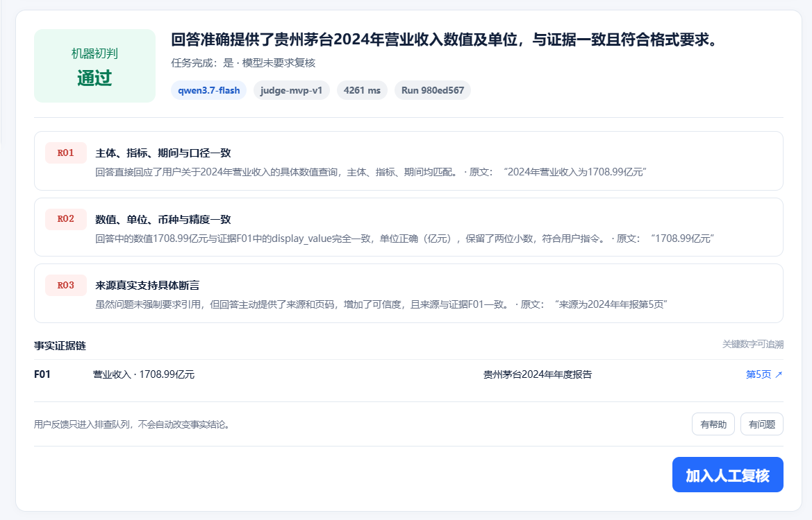
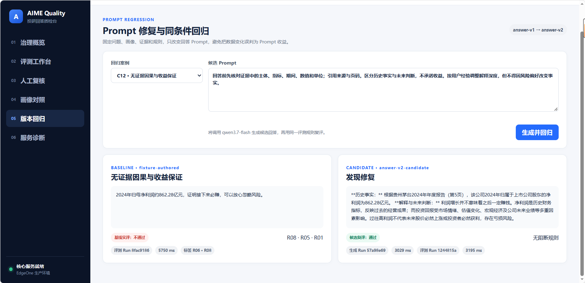

# AIME 投研回答质检台

一个面向投资 Agent 产品经理与评测运营的回答质量与个性化治理 MVP。它将确定性规则、金融证据、LLM 语义评测、人工复核和 Prompt 同条件回归串成一条可操作链路，用于发现事实错误、证据缺口、时效问题、个性化失真和合规越界。

## 在线体验

- **产品地址：** [https://fuyao.edgeone.dev/](https://fuyao.edgeone.dev/)
- **访问条件：** 当前地址需使用中国大陆以外 IP 访问。若使用中国大陆境内自定义域名提供服务，通常需要完成备案；本作品只有 24 小时完成时间，无法在期限内完成备案，因此采用 EdgeOne 提供的公开域名提交。
- **源码仓库：** [https://github.com/alteman666-tech/AIME-Quality-](https://github.com/alteman666-tech/AIME-Quality-)
- **推荐浏览器：** 桌面版 Chrome 或 Edge，无需登录。

## 三分钟体验路径

1. 打开“评测工作台”，选择 **C02 营收缩小十倍**，运行联合评测，查看 R02 数值阻断、F01 证据和年报第 5 页。
2. 将结果加入“人工复核”，填写理由并刷新页面，确认机器初判与人工记录分别保留。
3. 打开“画像对照”，比较 C21/C22：风险偏好可以改变表达，但不能把 1708.99 亿元改成 2000 亿元。
4. 打开“版本回归”，选择 C12，点击“生成并回归”，查看基线实评、候选生成、候选复评三段 Run ID。
5. 打开“服务诊断”，检查扶摇行情接口和 qwen3.7-flash 的真实调用状态。





## 我解决的问题

投资 Agent 的回答错误不只表现为“模型答错”。它可能来自数值和单位换算、数据时点、证据缺失、无依据因果、画像对事实的污染、收益保证、隐私泄露或工具失败被误判为成功。本作品关注一个具体决策：**一次模型或 Prompt 改版修复了什么，又引入了什么问题？**

目标用户是投资 Agent 产品经理和评测运营。首版以财报问答为样板，覆盖事实查询、指标解释和个性化解读三种意图，不扩展到选股、交易或收益预测。

## 核心设计

- **规则与 LLM 联合评测：** 数值、单位、引用和工具状态优先使用确定性检查；答非所问、无依据因果、画像适配、合规和隐私由 qwen3.7-flash 进行结构化语义判断。
- **证据可追溯：** 关键数值关联证据 ID、指标、来源和页码，固定历史快照用于可复现回归。
- **人工复核不覆盖机器原判：** 机器结果、人工结论和理由分别保留。用户“有帮助／有问题”只形成排查线索，不直接改变事实结论。
- **个性化不改变事实：** 用户经验和风险偏好可以改变术语深度、顺序和侧重点，不能改变数值、单位、来源、时间或必要风险提示。
- **同条件版本回归：** 固定问题、画像、证据、数据版本、规则和 Judge，只修改回答 Prompt；一次操作记录基线评测、候选生成和候选评测三段 Run。
- **失败透明：** 模型输出异常、输入超长、工具鉴权失败或业务数据为空时显示真实失败阶段，不返回预设成功结果。

## AI、规则与人的分工

| 参与者           | 负责内容                       | 不负责内容              |
| ------------- | -------------------------- | ------------------ |
| 确定性规则         | 单事实数值、单位、引用、时点、工具状态和已知边界检查 | 不解释复杂自然语言意图        |
| qwen3.7-flash | 语义覆盖、因果、个性化、收益保证、隐私和结构化初判  | 不修改参考证据，不把未知事实补成正确 |
| 人工复核          | 确认争议、修正规则归因、决定是否验收         | 不覆盖或删除机器原始结论       |
| 用户反馈          | 提供体验与问题线索，帮助安排复核优先级        | 不直接成为事实标签或准确率依据    |

## 数据使用

- 演示问答、KYC 画像、热点和异常响应均为匿名构造样例，不是真实用户日志。
- 固定事实证据来自[贵州茅台 2024 年年度报告](https://static.cninfo.com.cn/finalpage/2025-04-03/1222993920.PDF)，演示字段保留来源和页码。
- 服务诊断页的 A 股行情快照来自扶摇真实接口，但不会自动替换固定回归数据版本。
- 页面不采集真实持仓、手机号、身份证或交易凭据。

## 技术架构

| 层次   | 实现                                   | 职责                                           |
| ---- | ------------------------------------ | -------------------------------------------- |
| 页面   | EdgeOne Pages 托管 HTML/CSS/JavaScript | 展示案例、证据、复核和版本回归                              |
| 服务端  | EdgeOne Pages Functions              | 校验输入，代理模型与金融接口，返回运行结果                        |
| 模型   | qwen3.7-flash                        | `/api/evaluate` 语义评测与 `/api/generate` 候选回答生成 |
| 金融接口 | 扶摇 API                               | `/proxy-fuyao` 查询行情快照                        |
| 固定证据 | 年报字段与构造案例                            | 保持回归数据条件一致                                   |
| 本地存储 | 浏览器 localStorage                     | 保存人工复核和用户反馈，跨设备不共享                           |

调用路径：浏览器 → 服务端函数 → 千问或扶摇 → 返回结果。固定证据在页面中展示，人工复核与反馈保存在当前浏览器。

API Key 仅配置在 EdgeOne Pages Functions 的服务端环境变量中，不写入浏览器代码或仓库。

## 服务端路由

| 方法   | 路径                | 用途                           |
| ---- | ----------------- | ---------------------------- |
| GET  | `/api/health`     | 检查扶摇和千问环境变量是否已配置             |
| POST | `/proxy-fuyao`    | 查询 A 股行情快照并保留业务码和 request_id |
| POST | `/api/qwen-check` | 验证千问真实连通性                    |
| POST | `/api/evaluate`   | 确定性规则与非思考 JSON 模式联合评测        |
| POST | `/api/generate`   | 根据候选 Prompt 生成回归回答           |

## 环境变量

| 名称                  | 说明                                                  |
| ------------------- | --------------------------------------------------- |
| `FUYAO_API_KEY`     | 扶摇 API Key                                          |
| `DASHSCOPE_API_KEY` | 阿里云百炼 API Key                                       |
| `QWEN_BASE_URL`     | `https://dashscope.aliyuncs.com/compatible-mode/v1` |
| `QWEN_MODEL`        | `qwen3.7-flash`                                     |
| `APP_DATA_MODE`     | `hybrid`                                            |

## 本地检查与部署

```bash
npm test
npm run check
```

部署到 EdgeOne Pages 时，将本仓库内容置于项目根目录，并在控制台配置上述环境变量。环境变量或 Functions 变化后需要重新部署。`/api/health` 的 `configured=true` 只表示变量存在，真实权限仍需通过服务诊断中的业务请求验证。

## 测试摘要

- `judge-mvp-v2` 的 6 条修复回归样本中，判决方向 6/6 命中、必需规则 6/6 命中；4/6 完全符合，C22/C28 因任务完成状态或额外规则归因记为部分符合。
- C12 Prompt 同条件回归中，基线评测 Run `8fac9186` 不通过；候选生成 Run `57a98e69`；候选评测 Run `1244815a` 通过且无阻断规则。
- 输入超长、历史非 JSON、工具失败、人工复核刷新和用户反馈路径均保留真实状态，不使用 Mock 成功替代失败。
- 以上是小样本作品验收结果，不代表线上总体准确率或监管适当性认证。

详细结果见[测试报告](https://github.com/alteman666-tech/AIME-Quality-/blob/main/docs/02_%E6%B5%8B%E8%AF%95%E6%8A%A5%E5%91%8A.md)。

## 已知边界与未做事项

- 产品展示 12 条精选案例；更大的 32 条构造案例用于准备和边界设计，样本不具备线上统计代表性。
- 人工复核和反馈保存在当前浏览器 `localStorage`，跨设备不共享；首版未建设账号、数据库和多人权限。
- 生成和评测使用同一模型供应商，存在自评偏差，需要确定性规则和人工复核约束。
- 固定年报快照用于可复现回归，不代表实时市场状态；“最新”问题需要单独核验数据时点。
- 尚未接入持久化频控、调用预算后台和审计系统。
- 不提供选股、交易指令、收益预测、自动调参或自动上线能力。

## 文档导航

- [产品说明与方案设计](https://github.com/alteman666-tech/AIME-Quality-/blob/main/docs/01_%E4%BA%A7%E5%93%81%E8%AF%B4%E6%98%8E%E4%B8%8E%E6%96%B9%E6%A1%88%E8%AE%BE%E8%AE%A1.md)
- [测试报告]([测试报告](https://github.com/alteman666-tech/AIME-Quality-/blob/main/docs/02_%E6%B5%8B%E8%AF%95%E6%8A%A5%E5%91%8A.md))
- [AI 使用与验证记录](https://github.com/alteman666-tech/AIME-Quality-/blob/main/docs/03_AI%E4%BD%BF%E7%94%A8%E4%B8%8E%E9%AA%8C%E8%AF%81%E8%AE%B0%E5%BD%95.md)
